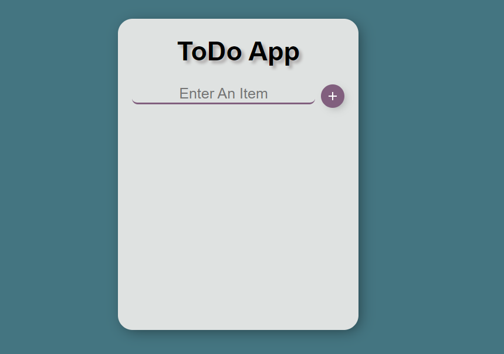
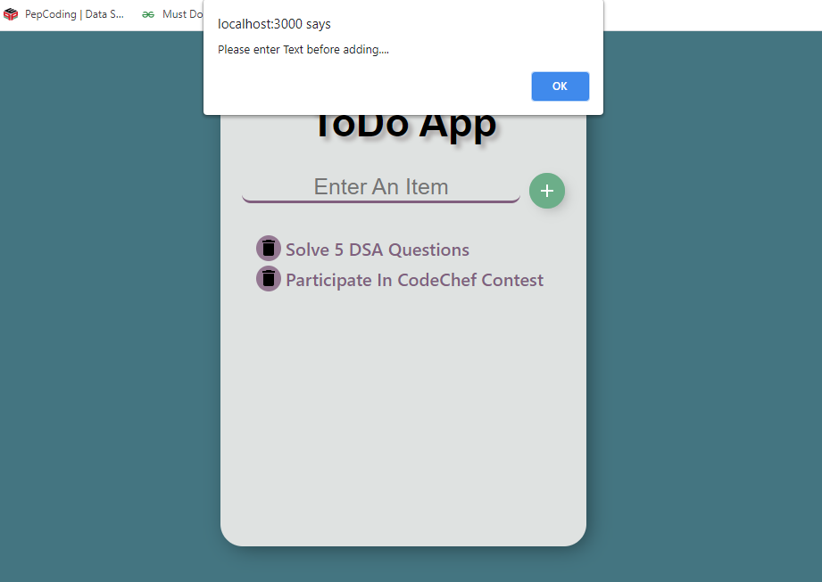

# ToDoApp using React
***In this ToDoApp there is two projects***
1.Using Material-UI 
-ToDoAppMatUI is the main component
2.Without using it
-ToDoList is the main component of it

## Functionalities
>You can enter your todo task and save is using the plus button
>If the input is empty it will through an alert
>You can mark the completed task using the delete button

###screenshots
1.

2.
